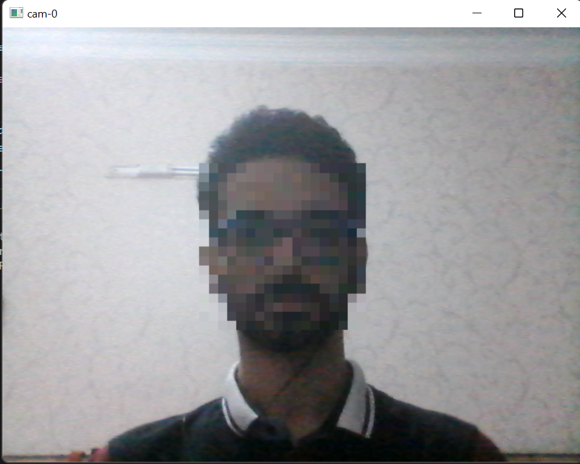
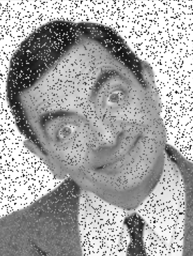
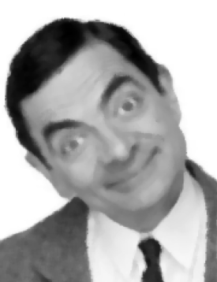

Face Blur
- Face recognition from assignment 23 + face blur option.
> 
> 

High Contrast
- Make target high contrast for better color detection(black - white - gray).

> 

## Increase Contrast Methods
> 
> 

## Sudoku Filled Square Detection
- Find filled squares in sudoku.
  - [x] 1- Find sudoku in image.
  - [x] 2- Adjust contrast.
  - [x] 3- Walk through squares and find digits!
  - [x] 4- Save each square as an image.
> 

## Mnist Numbers
- Split 5000 numbers one by one and save them in separate folders.

## Snowfall Effect
- Create a snow effect by **opencv** and make a gif out of it with **imageio** library.
> 

## Make S&P Noise and Noise Reduction + Face Align with Eyes
- Make Salt and Peper Noise and reduce noises by getting median with specific kernel size.
> 

 </>
- Face align with eyes by taking the angle of rotation of the face with **MTCNN**.
> 
